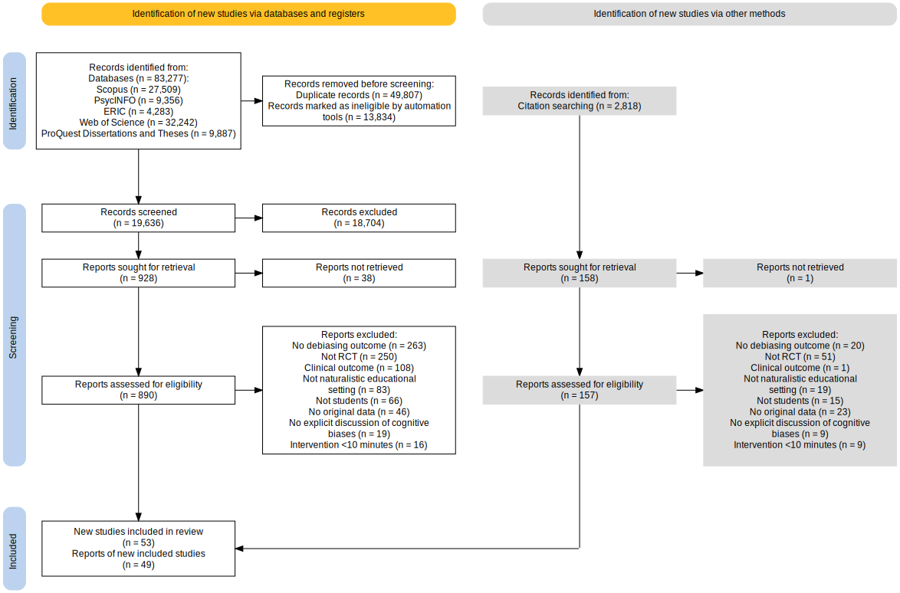

# Results

## Study Characteristics

```{r global_options, include = F, echo = F}
rm(list=ls())
library(tidyverse)
library(janitor)
library(googlesheets4)
library(dplyr)
library(compute.es)
library(metaSEM)
library(lavaan)
library(gt)
library(metadat)
library(meta)
library(metafor)
library(ggplot2)
library(renv)
library(esc)
library(stringr)
library(metacart)
library(readxl)
library(robvis)
library(PRISMA2020)
library(PublicationBias)
library(weightr)
library(svglite)
library(MetaUtility)

renv::restore()

#remove existing environment
rm(list=ls())

clean_data <- readRDS("clean_data.RDS")
if(!exists("clean_data")){
  #Read dataset from Data Extraction sheet
gs4_deauth() # so no need for authorisation
data_url <- "https://docs.google.com/spreadsheets/d/1tXKdUoxKoB8Nw9uDMtFxUAY6d3hU-avqlYuT60sNRFE/edit?usp=sharing"
raw_data <- googlesheets4::read_sheet(data_url, 
                                      skip = 2,
                                      na = c("","na", "NA", "Na", "nr", "Nr", ".", "NR"),
                                      col_types = paste(c(rep("c",44),
                                                        rep("n",63-45),
                                                        "cnnnnn"),
                                                        collapse = ""))


#### Data cleaning and processing pre effect size conversion ####

# Find symbols and numbers at the end of the column names and remove them
names(raw_data) <- gsub("\\.\\.\\.[0-9][0-9]$",
                        "",
                        names(raw_data))

raw_data <- clean_names(raw_data) #Adding underscores instead of spaces
colnames(raw_data) #Finding column names that are already cleaned up

raw_data <- raw_data %>%
            filter(country_of_sample != "Country", 
                   extractor_1 == "Consensus")

# Make a variable for pc_female that uses the n_girls and total sample size
# change to numeric while setting NULL to NA
raw_data$total_sample_size_at_start_of_study <- as.numeric(lapply(raw_data$total_sample_size_at_start_of_study, as.numeric))
raw_data$girls_n <- as.numeric(lapply(raw_data$girls_n, as.numeric))
raw_data$mean_age_at_start_of_study_in_years <- as.numeric(lapply(raw_data$mean_age_at_start_of_study_in_years, as.numeric))
raw_data$age_sd_in_years <- as.numeric(lapply(raw_data$age_sd_in_years, as.numeric))
raw_data$duration_of_intervention_in_minutes <- as.numeric(lapply(raw_data$duration_of_intervention_in_minutes, as.numeric))
raw_data$time_lag_between_completion_of_intervention_and_post_measurement_in_days <- as.numeric(lapply(raw_data$time_lag_between_completion_of_intervention_and_post_measurement_in_days, as.numeric))

raw_data <- raw_data %>%
mutate(pc_female = girls_n / total_sample_size_at_start_of_study * 100) 

# Find symbols and numbers in the rows and remove them
girls_n <- gsub("^([0-9][0-9]%)$",
                        "",
                        raw_data$girls_n)


# Clean up the age data by taking the average of the two numbers, if there is two
raw_data$mean_age_at_start_of_study_in_years
stringr::str_extract_all(raw_data$mean_age_at_start_of_study_in_years,"\\([0-9,.]+\\)?")[[1]]

# Create M(SD) age variable
raw_data <- raw_data %>% 
  mutate(mean_sd = paste(mean_age_at_start_of_study_in_years,'(', age_sd_in_years,')', sep = " "))

saveRDS(raw_data,
        "clean_data.RDS")
}
summary(clean_data)

RoB <- readRDS("Risk_of_Bias.RDS")

#### Hierarchical Meta-Analysis ####
## Pooling Effect Sizes Using Standardised Mean Differences ##

metaanalysis <- metafor::escalc(measure = "SMD",
                                data = clean_data,
                                m1i = intervention_group_mean_at_t2, 
                                m2i = comparison_group_mean_at_t2, 
                                sd1i = intervention_group_sd_at_t2, 
                                sd2i= comparison_group_sd_at_t2, 
                                n1i = intervention_group_sample_size_used_to_calculate_effect,
                                n2i = comparison_group_sample_size_used_to_calculate_effect,
                                ti = effect_size,
                                pi = exact_p_value_if_ci_not_reported,
                                drop00=FALSE,
                                var.names=c("yi","vi"),
                                add.measure=FALSE,
                                replace=FALSE)

metaanalysis$yi <- ifelse(metaanalysis$is_lower_better_or_worse=="Higher is better",
                          metaanalysis$yi, -metaanalysis$yi)

# find NAs that have data in the dichotomous column 
calc_fail_effects <- metaanalysis %>% filter(is.na(intervention_group_mean_at_t2) 
                                             & is.na(comparison_group_mean_at_t2)
                                             & is.na(effect_size))
str(calc_fail_effects$comparison_group_sample_size_used_to_calculate_effect)

# find effect size for this study (Bou Khalil et al, 2022)
yi <- failes(calc_fail_effects$intervention_group_fail_at_t2,
             calc_fail_effects$control_group_fail_at_t2,
             calc_fail_effects$intervention_group_sample_size_used_to_calculate_effect, 
             calc_fail_effects$comparison_group_sample_size_used_to_calculate_effect)

calc_fail_effects$yi <- yi$g
calc_fail_effects$vi <- yi$var.g

# binding back to metaanalysis object
metaanalysis <- metaanalysis %>% filter(!effect_id %in% calc_fail_effects$effect_id) %>%
  bind_rows(calc_fail_effects)

# find effect size for Almashat (2008) - Odds Ratio
calc_OR_effects <- metaanalysis %>% filter(effect_type == "OR")
log_OR <- log(calc_OR_effects$effect_size)

OR_yi <- lores(log_OR, 
               calc_OR_effects$standard_error, 
               calc_OR_effects$intervention_group_sample_size_used_to_calculate_effect, 
               calc_OR_effects$comparison_group_sample_size_used_to_calculate_effect)

calc_OR_effects$yi <- OR_yi$g
calc_OR_effects$vi <- OR_yi$var.g

# binding back to metaanalysis object
metaanalysis <- metaanalysis %>% filter(!effect_id %in% calc_OR_effects$effect_id) %>%
  bind_rows(calc_OR_effects)


#### Separate meta-analyses based on outcomes instead of collapsing them ####
meta_likelihood <- metaanalysis %>% 
  filter(construct_type == "Likelihood of Committing Biases") %>% 
  filter(type_of_comparison != "Alternative Methods of Debiasing")

likelihood_analysis <- rma.mv(yi = yi, 
                          V = vi, 
                          slab = apa_citation,
                          data = meta_likelihood,
                          random = ~ 1 | apa_citation, 
                          test = "t", 
                          method = "REML")

print(likelihood_analysis, digits =3)

sum(is.na(meta_likelihood$intervention_group_mean_at_t1[!duplicated(meta_likelihood$covidence_id)]))

#### Without binary outcomes ####

meta_no_bin <- meta_likelihood %>% 
  filter(type_of_comparison != "Alternative Methods of Debiasing",
         !grepl("OR", effect_type),
         is.na(intervention_group_fail_at_t1))

no_bin_analysis <- rma.mv(yi = yi, 
                          V = vi, 
                          slab = apa_citation,
                          data = meta_no_bin,
                          random = ~ 1 | apa_citation, 
                          test = "t", 
                          method = "REML")

print(no_bin_analysis, digits =3)


#### Without social group memberships ####

meta_no_social <- meta_likelihood %>% 
  filter(!grepl("attribution|stereotyping|weight bias|halo", bias_summarised, ignore.case = TRUE)) %>% 
  filter(type_of_comparison != "Alternative Methods of Debiasing")

no_soc_analysis <- rma.mv(yi = yi, 
                          V = vi, 
                          slab = apa_citation,
                          data = meta_no_social,
                          random = ~ 1 | apa_citation, 
                          test = "t", 
                          method = "REML")

print(no_soc_analysis, digits =3)

#### Just social group membership biases ####

meta_social <- meta_likelihood %>% 
  filter(grepl("attribution|stereotyping|weight bias|halo", bias_summarised, ignore.case = TRUE)) %>% 
  filter(type_of_comparison != "Alternative Methods of Debiasing")

soc_analysis <- rma.mv(yi = yi, 
                          V = vi, 
                          slab = apa_citation,
                          data = meta_social,
                          random = ~ 1 | apa_citation, 
                          test = "t", 
                          method = "REML")

print(soc_analysis, digits =3)

# Get moderator effect for social group analysis

meta_likelihood$social <- grepl("attribution|stereotyping|weight bias|halo",
                                meta_likelihood$bias_summarised,
                                ignore.case = TRUE)
soc_moderator <- rma.mv(yi = yi, 
                       V = vi, 
                       slab = apa_citation,
                       data = meta_likelihood,
                       random = ~ 1 | apa_citation, 
                       test = "t", 
                       mods = ~ social,
                       method = "REML")
soc_moderator

#### Comparing estimates post-intervention and delayed ####
meta_post <- metaanalysis %>% 
  filter(construct_type == "Likelihood of Committing Biases") %>% 
  filter(type_of_comparison != "Alternative Methods of Debiasing") %>%
  filter(time_lag_between_completion_of_intervention_and_post_measurement_in_days == "0")

post_analysis <- rma.mv(yi = yi, 
                              V = vi, 
                              slab = apa_citation,
                              data = meta_post,
                              random = ~ 1 | apa_citation, 
                              test = "t", 
                              method = "REML")

print(post_analysis, digits =3)

meta_delayed <- metaanalysis %>% 
  filter(construct_type == "Likelihood of Committing Biases") %>% 
  filter(type_of_comparison != "Alternative Methods of Debiasing") %>%
  filter(time_lag_between_completion_of_intervention_and_post_measurement_in_days != "0")

delayed_analysis <- rma.mv(yi = yi, 
                        V = vi, 
                        slab = apa_citation,
                        data = meta_delayed,
                        random = ~ 1 | apa_citation, 
                        test = "t", 
                        method = "REML")

print(delayed_analysis, digits =3)


W <- diag(1/likelihood_analysis$vi)
X <- model.matrix(likelihood_analysis)
P <- W - W %*% X %*% solve(t(X) %*% W %*% X) %*% t(X) %*% W
I2 <- 100 * sum(likelihood_analysis$sigma2) / (sum(likelihood_analysis$sigma2) + 
        (likelihood_analysis$k-likelihood_analysis$p)/sum(diag(P)))

I2

### PRISMA Flow Diagram ### 

prisma_data <- PRISMA_data(read.csv("prisma_data.csv")) 
x <- read.csv("prisma_data.csv", header = TRUE, stringsAsFactors=FALSE) 
x <- subset(x, select = c(data,n))
x <- na.omit(x)
x$n <- as.numeric(x$n)
```

The full results of the study selection process are shown in the PRISMA flow diagram in Figure 1 (Haddaway et al., 2022; Page et al., 2021). Following database search, duplicate removals, and filtering studies through RobotSearch, we screened `r format(prisma_data$records_screened, big.mark=",")` studies using their titles and abstracts. We located an additional `r prisma_data$citations_results` studies by searching the reference lists of included studies. After screening, we assessed `r format(x$n[x$data == "dbr_sought_reports"]+x$n[x$data == "other_sought_reports"], big.mark=",")` full-text articles in duplicate against eligibility criteria. Of those, we excluded `r format(x$n[x$data == "dbr_sought_reports"] + x$n[x$data == "other_sought_reports"] - x$n[x$data == "new_studies"], big.mark=",")` studies, usually because they were not randomised or because there was no measure of cognitive bias. Full details of reasons for exclusion are outlined in Supplementary File 1. This further selection left a total of `r x$n[x$data == "new_studies"]` studies and a pooled sample size of `r clean_data %>%distinct(apa_citation,study_num, .keep_all = TRUE) %>% select(total_sample_size_at_start_of_study) %>% sum() %>% format(big.mark=",")` participants. Characteristics of each included study are available in Supplementary Table 1.

**Figure 1**

*PRISMA flow diagram for inclusion in this systematic review*

```{r, echo = F}

```

## Effects of Education on the Likelihood of Committing Cognitive Biases

```{r include = F}
#### Hierarchical Meta-Analysis ####
## Pooling Effect Sizes Using Standardised Mean Differences ##

metaanalysis <- metafor::escalc(measure = "SMD",
                                data = clean_data,
                                m1i = intervention_group_mean_at_t2, 
                                m2i = comparison_group_mean_at_t2, 
                                sd1i = intervention_group_sd_at_t2, 
                                sd2i= comparison_group_sd_at_t2, 
                                n1i = intervention_group_sample_size_used_to_calculate_effect,
                                n2i = comparison_group_sample_size_used_to_calculate_effect,
                                ti = effect_size,
                                pi = exact_p_value_if_ci_not_reported,
                                drop00=FALSE,
                                var.names=c("yi","vi"),
                                add.measure=FALSE,
                                replace=FALSE)

metaanalysis$yi <- ifelse(metaanalysis$is_lower_better_or_worse=="Higher is better",
                          metaanalysis$yi, -metaanalysis$yi)

# find NAs that have data in the dichotomous column 
calc_fail_effects <- metaanalysis %>% filter(is.na(intervention_group_mean_at_t2) 
                                             & is.na(comparison_group_mean_at_t2)
                                             & is.na(effect_size))
str(calc_fail_effects$comparison_group_sample_size_used_to_calculate_effect)

# find effect size for this study (Bou Khalil et al, 2022)
yi <- failes(calc_fail_effects$intervention_group_fail_at_t2,
             calc_fail_effects$control_group_fail_at_t2,
             calc_fail_effects$intervention_group_sample_size_used_to_calculate_effect, 
             calc_fail_effects$comparison_group_sample_size_used_to_calculate_effect)

calc_fail_effects$yi <- yi$g
calc_fail_effects$vi <- yi$var.g

# binding back to metaanalysis object
metaanalysis <- metaanalysis %>% filter(!effect_id %in% calc_fail_effects$effect_id) %>%
  bind_rows(calc_fail_effects)

# find effect size for Almashat (2008) - Odds Ratio
calc_OR_effects <- metaanalysis %>% filter(effect_type == "OR")
log_OR <- log(calc_OR_effects$effect_size)

OR_yi <- lores(log_OR, 
               calc_OR_effects$standard_error, 
               calc_OR_effects$intervention_group_sample_size_used_to_calculate_effect, 
               calc_OR_effects$comparison_group_sample_size_used_to_calculate_effect)

calc_OR_effects$yi <- OR_yi$g
calc_OR_effects$vi <- OR_yi$var.g

# binding back to metaanalysis object
metaanalysis <- metaanalysis %>% filter(!effect_id %in% calc_OR_effects$effect_id) %>%
  bind_rows(calc_OR_effects)


#### Separate meta-analyses based on outcomes instead of collapsing them ####
meta_likelihood <- metaanalysis %>% 
  filter(construct_type == "Likelihood of Committing Biases") %>% 
  filter(type_of_comparison != "Alternative Methods of Debiasing")

likelihood_analysis <- rma.mv(yi = yi, 
                          V = vi, 
                          slab = apa_citation,
                          data = meta_likelihood,
                          random = ~ 1 | apa_citation, 
                          test = "t", 
                          method = "REML")

print(likelihood_analysis, digits =3)

sum(is.na(meta_likelihood$intervention_group_mean_at_t1[!duplicated(meta_likelihood$covidence_id)]))

#### Without binary outcomes ####

meta_no_bin <- meta_likelihood %>% 
  filter(type_of_comparison != "Alternative Methods of Debiasing",
         !grepl("OR", effect_type),
         is.na(intervention_group_fail_at_t1))

no_bin_analysis <- rma.mv(yi = yi, 
                          V = vi, 
                          slab = apa_citation,
                          data = meta_no_bin,
                          random = ~ 1 | apa_citation, 
                          test = "t", 
                          method = "REML")

print(no_bin_analysis, digits =3)


#### Without social group memberships ####

meta_no_social <- meta_likelihood %>% 
  filter(!grepl("attribution|stereotyping|weight bias|halo", bias_summarised, ignore.case = TRUE)) %>% 
  filter(type_of_comparison != "Alternative Methods of Debiasing")

no_soc_analysis <- rma.mv(yi = yi, 
                          V = vi, 
                          slab = apa_citation,
                          data = meta_no_social,
                          random = ~ 1 | apa_citation, 
                          test = "t", 
                          method = "REML")

print(no_soc_analysis, digits =3)

#### Just social group membership biases ####

meta_social <- meta_likelihood %>% 
  filter(grepl("attribution|stereotyping|weight bias|halo", bias_summarised, ignore.case = TRUE)) %>% 
  filter(type_of_comparison != "Alternative Methods of Debiasing")

soc_analysis <- rma.mv(yi = yi, 
                          V = vi, 
                          slab = apa_citation,
                          data = meta_social,
                          random = ~ 1 | apa_citation, 
                          test = "t", 
                          method = "REML")

print(soc_analysis, digits =3)

# Get moderator effect for social group analysis

meta_likelihood$social <- grepl("attribution|stereotyping|weight bias|halo",
                                meta_likelihood$bias_summarised,
                                ignore.case = TRUE)
soc_moderator <- rma.mv(yi = yi, 
                       V = vi, 
                       slab = apa_citation,
                       data = meta_likelihood,
                       random = ~ 1 | apa_citation, 
                       test = "t", 
                       mods = ~ social,
                       method = "REML")
soc_moderator

#### Comparing estimates post-intervention and delayed ####
meta_post <- metaanalysis %>% 
  filter(construct_type == "Likelihood of Committing Biases") %>% 
  filter(type_of_comparison != "Alternative Methods of Debiasing") %>%
  filter(time_lag_between_completion_of_intervention_and_post_measurement_in_days == "0")

post_analysis <- rma.mv(yi = yi, 
                              V = vi, 
                              slab = apa_citation,
                              data = meta_post,
                              random = ~ 1 | apa_citation, 
                              test = "t", 
                              method = "REML")

print(post_analysis, digits =3)

meta_delayed <- metaanalysis %>% 
  filter(construct_type == "Likelihood of Committing Biases") %>% 
  filter(type_of_comparison != "Alternative Methods of Debiasing") %>%
  filter(time_lag_between_completion_of_intervention_and_post_measurement_in_days != "0")

delayed_analysis <- rma.mv(yi = yi, 
                        V = vi, 
                        slab = apa_citation,
                        data = meta_delayed,
                        random = ~ 1 | apa_citation, 
                        test = "t", 
                        method = "REML")

print(delayed_analysis, digits =3)


W <- diag(1/likelihood_analysis$vi)
X <- model.matrix(likelihood_analysis)
P <- W - W %*% X %*% solve(t(X) %*% W %*% X) %*% t(X) %*% W
I2 <- 100 * sum(likelihood_analysis$sigma2) / (sum(likelihood_analysis$sigma2) + 
        (likelihood_analysis$k-likelihood_analysis$p)/sum(diag(P)))

I2


prop_good <- prop_stronger(q = 0.2, 
                           M = coef(likelihood_analysis), 
                           se.M = likelihood_analysis$se, 
                           ci.level=0.95, 
                           tail="above", 
                           dat = meta_likelihood, 
                           yi.name="yi", 
                           vi.name="vi",
                           cluster.name="apa_citation")

prop_bad <- prop_stronger(q = -0.2, 
                          M = coef(likelihood_analysis), 
                          se.M = likelihood_analysis$se, 
                          ci.level=0.95, 
                          tail="below", 
                          dat = meta_likelihood, 
                          yi.name="yi", 
                          vi.name="vi",
                          cluster.name="apa_citation")

present_prop_stronger_results <- function(mod){
  paste(c("(",format(round(mod$est*100,0), nsmall = 0),
          "% of true effects, 95% CI [",
          format(round(mod$lo*100,0), nsmall = 0),
          "%, ",
          format(round(mod$hi*100,0), nsmall = 0),
          "%])"), collapse = "")
}

present_prop_stronger_results(prop_good)
present_prop_stronger_results(prop_bad)

#### Forest Plots for Likelihood Aggregated Results ####

agg_likelihood <- aggregate(meta_likelihood, 
                 cluster=apa_citation, 
                 rho = 0.01,
                 addk=TRUE)

agg_likelihood <- agg_likelihood[order(agg_likelihood$apa_citation),]
agg_likelihood <- agg_likelihood %>% select(covidence_id, effect_id, apa_citation, title,
                      published_year, peer_reviewed,
                      education_setting,
                      construct_type,
                      types_of_biases,
                      debiasing_strategies_taught,
                      delivery_format,
                      intervention_focus,
                      computer_aided_online_vs_human_delivered_intervention,
                      yi, vi, ki)

res_likelihood <- rma.mv(yi = yi, 
              V = vi, 
              slab = apa_citation,
              data = agg_likelihood,
              random = ~ 1 | apa_citation, 
              test = "t", 
              method = "REML")

print(res_likelihood,digits = 3)

#### Knowledge ####

meta_knowledge <- metaanalysis %>% 
  filter(construct_type == "Specific Knowledge of Biases") %>% 
  filter(type_of_comparison != "Alternative Methods of Debiasing")


#### General Reasoning ####

meta_reasoning <- metaanalysis %>% 
  filter(construct_type == "Improved General Reasoning or Cognition") %>% 
  filter(type_of_comparison != "Alternative Methods of Debiasing") 


#### grabbing only delayed post-test results ####

meta_likelihood$follow_up_point <- meta_likelihood$time_lag_between_completion_of_intervention_and_post_measurement_in_days>0
reviewer_time_mod <- rma.mv(yi = yi, 
                             V = vi, 
                             slab = apa_citation,
                             data = meta_likelihood,
                             random = ~ 1 | apa_citation, 
                             test = "t", 
                             method = "REML",
                             mods = ~follow_up_point)

print(reviewer_time_mod, digits = 3)

follow_up <- meta_likelihood %>%
  filter(follow_up_point == TRUE) %>%
  distinct(apa_citation)

print(follow_up)

### Forest Plot Likelihood ####

svglite::svglite("agg_likelihood_forest_plot.svg",
                 width = 10,
                 height = 15)

forest_likelihood <- meta::forest(res_likelihood,
                           mlab="Pooled Estimate",
                           refline = 0,
                           header="Author(s) and Year", 
                           slab=apa_citation,
                           order = yi,
                           showweights=TRUE,
                           shade="zebra")

dev.off()

png(file="agg_likelihood_forest_plot.png",
    width = 850,
    height = 1250)
forest_res <- meta::forest(res_likelihood,
                           mlab="Pooled Estimate",
                           refline = 0,
                           header="Author(s) and Year", 
                           slab=apa_citation,
                           order = yi,
                           showweights=TRUE,
                           shade="zebra")

dev.off()

#### Funnel Plot for Likelihood ####

svglite::svglite("eggers_funnel_likelihood.svg",
                 width = 10,
                 height = 10)

funnel.rma(res_likelihood, label = F,
           level=c(90, 95, 99), shade=c("white", "gray55", "gray75"))

dev.off()

png(file="eggers_funnel_likelihood.png",
    width = 750,
    height = 750)


funnel.rma(res_likelihood, label = F,
           level=c(90, 95, 99), shade=c("white", "gray55", "gray75"))

dev.off()

# Running Egger's test

res3 <- rma.mv(yi = yi,
               V = vi,
               random = ~ 1 | apa_citation,
               data = meta_likelihood, 
               test = "t",
               mods = ~ sqrt(vi))

summary(res3, digits = 3)

#### Finding Outliers ####

z <- subset(meta_likelihood, yi >= 2.5)

# found only one row with outlier above 2.5
meta_remove_rows <- subset(meta_likelihood, yi <= 2.5)

# running analysis without the yi more than 2 
remove_rows_analysis <- rma.mv(yi = yi, 
                               V = vi, 
                               slab = apa_citation,
                               data = meta_remove_rows,
                               random = ~ 1 | apa_citation,
                               method = "REML")

print(remove_rows_analysis, digits =3)

present_prop_stronger_results <- function(mod){
  paste(c("(",format(round(mod$est*100,0), nsmall = 0),
          "% of true effects, 95% CI [",
          format(round(mod$lo*100,0), nsmall = 0),
          "%, ",
          format(round(mod$hi*100,0), nsmall = 0),
          "%])"), collapse = "")
}


#### Moderation Analysis ####
#### Age - continuous variable ####
mod.age <- rma.mv(yi = yi, 
                  V = vi, 
                  slab = apa_citation, 
                  data = meta_likelihood,
                  random = ~ 1 | apa_citation, 
                  test = "t", method = "REML",
                  mods = ~ mean_age_at_start_of_study_in_years)

summary(mod.age)


#### Education Settings #### 
meta_likelihood$education_setting <- as.factor(meta_likelihood$education_setting)
mod.edsetting <- rma.mv(yi = yi, 
                        V = vi, 
                        slab = apa_citation, 
                        data = meta_likelihood,
                        random = ~ 1 | apa_citation, 
                        test = "t", method = "REML",
                        mods = ~ education_setting)

summary(mod.edsetting)

ed.set <- rma.mv(yi = yi, 
                 V = vi, 
                 slab = apa_citation, 
                 data = meta_likelihood,
                 random = ~ 1 | apa_citation, 
                 test = "t", method = "REML",
                 mods = ~ education_setting - 1)

summary(ed.set)

sum_mod_ed.set <- summary(ed.set)

ed.set_pvals <- ed.set$pval

#### Gender - continuously moderated #### 
mod.gender <- rma.mv(yi = yi, 
                     V = vi, 
                     slab = apa_citation, 
                     data = meta_likelihood,
                     random = ~ 1 | apa_citation, 
                     test = "t", method = "REML",
                     mods = ~ pc_female)

summary(mod.gender)


#### Intervention focus ####
meta_likelihood$intervention_focus <- as.factor(meta_likelihood$intervention_focus)
meta_likelihood$intervention_focus <- forcats::fct_relevel(meta_likelihood$intervention_focus, "Calibration Training")

focus_to_include <- meta_likelihood %>% 
  select(intervention_focus, apa_citation) %>%
  distinct() %>% 
  group_by(intervention_focus) %>%
  summarise(n = n()) %>%
  filter(n >= 3) %>%
  drop_na()

mod.intervention <- rma.mv(yi = yi, 
                           V = vi, 
                           slab = apa_citation, 
                           data = meta_likelihood %>% filter(intervention_focus
                                                             %in% focus_to_include$intervention_focus),
                           random = ~ 1 | apa_citation, 
                           test = "t", method = "REML",
                           mods = ~ intervention_focus)

summary(mod.intervention)

int <- rma.mv(yi = yi, 
              V = vi, 
              slab = apa_citation, 
              data = meta_likelihood %>% filter(intervention_focus
                                                %in% focus_to_include$intervention_focus),
              random = ~ 1 | apa_citation, 
              test = "t", method = "REML",
              mods = ~ intervention_focus - 1)

summary(int)

sum_mod_int <- summary(int)

int_pvals <- int$pval

interfocus_x_types_of_biases <- rma.mv(yi = yi, 
                                     V = vi, 
                                     slab = apa_citation, 
                                     data = meta_likelihood,
                                     random = ~ 1 | apa_citation, 
                                     test = "t", method = "REML",
                                     mods = ~ intervention_focus + types_of_biases)

summary(interfocus_x_types_of_biases)

#### Types of biases ####
meta_likelihood$types_of_biases <- as.factor(meta_likelihood$types_of_biases)

type_to_include <- meta_likelihood %>% 
  select(types_of_biases, apa_citation) %>%
  distinct() %>% 
  group_by(types_of_biases) %>%
  summarise(n = n()) %>%
  filter(n >= 3) %>%
  drop_na()

mod.type <- rma.mv(yi = yi, 
                   V = vi, 
                   slab = apa_citation, 
                   data = meta_likelihood %>% filter(types_of_biases
                                                 %in% type_to_include$types_of_biases),
                   random = ~ 1 | apa_citation, 
                   test = "t", method = "REML",
                   mods = ~ types_of_biases)

summary(mod.type)

types <- rma.mv(yi = yi, 
                V = vi, 
                slab = apa_citation, 
                data = meta_likelihood %>% filter(types_of_biases
                                              %in% type_to_include$types_of_biases),
                random = ~ 1 | apa_citation, 
                test = "t", method = "REML",
                mods = ~ types_of_biases - 1)

summary(types)

sum_mod_types <- summary(types)

types_pvals <- types$pval


#### Strategies taught #####
meta_likelihood$debiasing_strategies_taught <- as.factor(meta_likelihood$debiasing_strategies_taught)

strat_to_include <- meta_likelihood %>% 
  select(debiasing_strategies_taught, apa_citation) %>%
  distinct() %>% 
  group_by(debiasing_strategies_taught) %>%
  summarise(n = n()) %>%
  filter(n >= 3) %>%
  drop_na()

mod.strategies <- rma.mv(yi = yi, 
                         V = vi, 
                         slab = apa_citation, 
                         data = meta_likelihood %>% filter(debiasing_strategies_taught 
                                                        %in% strat_to_include$debiasing_strategies_taught),
                         random = ~ 1 | apa_citation, 
                         test = "t", method = "REML",
                         mods = ~ debiasing_strategies_taught)

summary(mod.strategies)

strat <- rma.mv(yi = yi, 
                V = vi, 
                slab = apa_citation, 
                data = meta_likelihood %>% filter(debiasing_strategies_taught 
                                               %in% strat_to_include$debiasing_strategies_taught),
                random = ~ 1 | apa_citation, 
                test = "t", method = "REML",
                mods = ~ debiasing_strategies_taught - 1)

summary(strat)

sum_mod_strat <- summary(strat)

strat_pvals <- strat$pval


#### Length of Intervention ####
meta_likelihood$duration_of_intervention_in_minutes <- scale(meta_likelihood$duration_of_intervention_in_minutes)
mod.time <- rma.mv(yi = yi, 
                   V = vi, 
                   slab = apa_citation, 
                   data = meta_likelihood,
                   random = ~ 1 | apa_citation, 
                   test = "t", method = "REML",
                   mods = ~ duration_of_intervention_in_minutes)

summary(mod.time)

#### Delivery Format ####
meta_likelihood$delivery_format <- forcats::fct_relevel(meta_likelihood$delivery_format,
                                                    "Traditional training")
mod.delivery <- rma.mv(yi = yi, 
                       V = vi, 
                       slab = apa_citation, 
                       data = meta_likelihood,
                       random = ~ 1 | apa_citation, 
                       test = "t", method = "REML",
                       mods = ~ delivery_format)

summary(mod.delivery)

delivery <- rma.mv(yi = yi, 
                   V = vi, 
                   slab = apa_citation, 
                   data = meta_likelihood,
                   random = ~ 1 | apa_citation, 
                   test = "t", method = "REML",
                   mods = ~ delivery_format - 1)

summary(delivery)

sum_mod_delivery <- summary(delivery)

delivery_pvals <- delivery$pval


#### Source of communication ####
meta_likelihood$computer_aided_online_vs_human_delivered_intervention <- forcats::fct_relevel(meta_likelihood$computer_aided_online_vs_human_delivered_intervention,
                                                     "In person")
source_to_include <- meta_likelihood %>% select(computer_aided_online_vs_human_delivered_intervention, apa_citation) %>%
  distinct() %>% 
  group_by(computer_aided_online_vs_human_delivered_intervention) %>%
  summarise(n = n()) %>%
  filter(n >= 3)

mod.source <- rma.mv(yi = yi, 
                     V = vi, 
                     slab = apa_citation, 
                     data = meta_likelihood %>% 
                       filter(computer_aided_online_vs_human_delivered_intervention %in% 
                                source_to_include$computer_aided_online_vs_human_delivered_intervention),
                     random = ~ 1 | apa_citation, 
                     test = "t", method = "REML",
                     mods = ~ computer_aided_online_vs_human_delivered_intervention)

summary(mod.source)

source <- rma.mv(yi = yi, 
                 V = vi, 
                 slab = apa_citation, 
                 data = meta_likelihood %>% 
                   filter(computer_aided_online_vs_human_delivered_intervention %in% 
                            source_to_include$computer_aided_online_vs_human_delivered_intervention),
                 random = ~ 1 | apa_citation, 
                 test = "t", method = "REML",
                 mods = ~ computer_aided_online_vs_human_delivered_intervention - 1)

summary(source)

sum_mod_source <- summary(source)

source_pvals <- source$pval


#### Biases ####

meta_likelihood$bias_summarised[meta_likelihood$bias_summarised=="Hostile attribution bias"] <- "Fundamental Attribution Error"

biases_to_include <- meta_likelihood %>% select(bias_summarised, apa_citation) %>%
  distinct() %>% 
  group_by(bias_summarised) %>%
  summarise(n = n()) %>%
  filter(n >= 3)

mod.bias <- rma.mv(yi = yi, 
                       V = vi, 
                       slab = apa_citation, 
                       data = meta_likelihood %>% filter(bias_summarised %in% biases_to_include$bias_summarised),
                       intercept = FALSE,
                       random = ~ 1 | apa_citation, 
                       test = "t", method = "REML",
                       mods = ~ bias_summarised)
summary(mod.bias)

biases <- rma.mv(yi = yi, 
                 V = vi, 
                 slab = apa_citation, 
                 data = meta_likelihood %>% filter(bias_summarised %in% biases_to_include$bias_summarised),
                 intercept = FALSE,
                 random = ~ 1 | apa_citation, 
                 test = "t", method = "REML",
                 mods = ~ bias_summarised - 1)

sum_mod_bias <- summary(biases)

bias_pvals <- biases$pval

# Create named vectors for each moderator group
int_names <- c(
  "intervention_Calibration_Training" = int$pval[1], 
  "intervention_Specific_Bias_Mitigation" = int$pval[2]
)

types_names <- c(
  "types_Attentional_bias" = types$pval[1],
  "types_Encapsulated_bias" = types$pval[2], 
  "types_Mixed_Unknown" = types$pval[3]
)

strat_names <- c(
  "strategies_Cognitive_oriented" = strat$pval[1],
  "strategies_Mixed" = strat$pval[2]
)

delivery_names <- c(
  "delivery_Traditional" = delivery$pval[1],
  "delivery_Games" = delivery$pval[2],
  "delivery_Mixed" = delivery$pval[3],
  "delivery_Text" = delivery$pval[4],
  "delivery_Video" = delivery$pval[5]
)

source_names <- c(
  "source_In_person" = source$pval[1],
  "source_Online" = source$pval[2]
)

bias_names <- c(
  "bias_Anchoring" = biases$pval[1],
  "bias_Causal_Illusions" = biases$pval[2],
  "bias_Confirmation" = biases$pval[3],
  "bias_Fundamental_Attribution" = biases$pval[4],
  "bias_Judgement_Accuracy" = biases$pval[5],
  "bias_Mixed" = biases$pval[6],
  "bias_Overconfidence" = biases$pval[7],
  "bias_Representativeness" = biases$pval[8]
)

# Combine all p-values
all_pvals <- c(int_names, types_names, strat_names, 
               delivery_names, source_names, bias_names)

# Apply FDR correction using the Benjamini-Hochberg method
fdr_corrected_pvals <- p.adjust(all_pvals, method = "BH")

# Create a data frame to see original and corrected p-values side by side
pvals_df <- data.frame(
  moderator = names(all_pvals),
  original_p = all_pvals,
  adjusted_p = fdr_corrected_pvals
) %>%
  arrange(adjusted_p)

print(pvals_df)

# Function to format p-values in APA style
format_p_values <- function(p) {
  case_when(
    p < 0.001 ~ "< .001",
    p >= 0.001 ~ sprintf("= %.3f", p) %>% str_replace("0.", ".")
  )
}

# Apply the formatting
pvals_df_apa <- pvals_df %>%
  mutate(
    original_p = format_p_values(original_p),
    adjusted_p = format_p_values(adjusted_p)
  )

print(pvals_df_apa)

#### Print Out Adj P-Values ####
get_adjusted_pvalue <- function(data, moderator_name) {
  # Find the row matching the moderator name
  p_value <- data$adjusted_p[data$moderator == moderator_name]
  
  # If no match found, return NA
  if (length(p_value) == 0) {
    return(NA)
  }
  
  # Return the p-value as is (it's already formatted as a string)
  return(p_value)
}

bias_x_strategy <- rma.mv(yi = yi, 
                   V = vi, 
                   slab = apa_citation, 
                   data = meta_likelihood %>% filter(bias_summarised %in% biases_to_include$bias_summarised),
                   intercept = FALSE,
                   random = ~ 1 | apa_citation, 
                   test = "t", method = "REML",
                   mods = ~ bias_summarised + debiasing_strategies_taught)

summary(bias_x_strategy)

#### Number of Sessions ####

mod.no.sessions <- rma.mv(yi = yi, 
                          V = vi, 
                          slab = apa_citation, 
                          data = meta_likelihood,
                          random = ~ 1 | apa_citation, 
                          test = "t", method = "REML",
                          mods = ~ one_off_multiple_sessions)

summary(mod.no.sessions)

#### Comparison Moderation ####
comp_likelihood <- metaanalysis %>% 
  filter(construct_type == "Likelihood of Committing Biases")


mod.comp.likelihood <- rma.mv(yi = yi, 
                              V = vi, 
                              slab = apa_citation, 
                              data = comp_likelihood,
                              random = ~ 1 | apa_citation, 
                              test = "t", method = "REML",
                              mods = ~ type_of_comparison)

summary(mod.comp.likelihood)

comp.likelihood <- rma.mv(yi = yi, 
                          V = vi, 
                          slab = apa_citation, 
                          data = comp_likelihood,
                          random = ~ 1 | apa_citation, 
                          test = "t", method = "REML",
                          mods = ~ type_of_comparison-1)

summary(comp.likelihood)


#### Only Likelihood Alternative Methods of Debiasing ####
alt_likelihood <- metaanalysis %>% 
  filter(construct_type == "Likelihood of Committing Biases") %>% 
  filter(type_of_comparison == "Alternative Methods of Debiasing")

alt_likelihood_analysis <- rma.mv(yi = yi, 
                                  V = vi, 
                                  slab = apa_citation,
                                  data = alt_likelihood,
                                  random = ~ 1 | apa_citation, 
                                  test = "t", 
                                  method = "REML")

print(alt_likelihood_analysis, digits =3)

### Comparing Educational Games to Videos ###

ed_vid_likelihood <- alt_likelihood %>% 
  filter(delivery_format == "Educational games") %>%
  filter(delivery_format_2 == "Video-based")

ed_vid_analysis <- rma.mv(yi = yi, 
                               V = vi, 
                               slab = apa_citation,
                               data = ed_vid_likelihood,
                               random = ~ 1 | apa_citation, 
                               test = "t", 
                               method = "REML")

print(ed_vid_analysis, digits =3)

#### Comparing Educational Games to Traditional Training ####
ed_trad_likelihood <- alt_likelihood %>% 
  filter(delivery_format == "Educational games") %>%
  filter(delivery_format_2 == "Traditional training")


#### Comparing Educational Games to Reading #### 
ed_read_likelihood <- alt_likelihood %>% 
  filter(delivery_format == "Educational games") %>%
  filter(delivery_format_2 == "Text / reading")

#### Comparing Mixed to Traditional Training ####

mixed_likelihood <- alt_likelihood %>% 
  filter(delivery_format == "Mixed") %>%
  filter(delivery_format_2 == "Traditional training")

mixed_likelihood_analysis <- rma.mv(yi = yi, 
                                  V = vi, 
                                  slab = apa_citation,
                                  data = mixed_likelihood,
                                  random = ~ 1 | apa_citation, 
                                  test = "t", 
                                  method = "REML")

print(mixed_likelihood_analysis, digits =3)

#### GGPlot for moderators ####

mods <- readRDS("moderators.RDS")

mods$groups[mods$groups == "Source of Information"] <- "Mode"
mods$groups[mods$groups == "Strategies Taught"] <- "Strategies"
mods$groups[mods$groups == "Types of Biases"] <- "Types"
mods$groups[mods$groups == "Intervention Focus"] <- "Focus"

mods$conditions <- factor(mods$conditions, 
                                levels = mods$conditions[order(mods$estimate)])

mod_n_k <- mods %>% select(conditions, estimate, groups, k, n)

xrange <- c(1,10)
yrange <- c(1,12)

geom.text.size = 3.5
theme.size = (14/5) * geom.text.size

m <- ggplot(data = mods, 
            aes(x = estimate,
                xmin = ci.ub,
                xmax = ci.lb,
                y = conditions)) + 
  geom_pointrange(aes(colour = groups)) +
  expand_limits(x = c(-0.5, 1.15)) +
  labs(x = "Effect Sizes", y = " ") +
  theme_minimal() %+replace%
  theme(axis.text.y = element_text(size = 9, hjust = 1,
                                   colour = "black"),
        legend.position = "none",
        plot.margin = margin(20,235,25,5),
        strip.placement = "outside") +
  coord_cartesian(clip = "off") +
  geom_text(x = 1.5, y = mods$conditions, hjust = 0.5, label = mods$n, size=geom.text.size) +
  geom_text(x = 1.75, y = mods$conditions, hjust = 0.5, label = format(mods$k, big.mark = ","), size=geom.text.size) +
  geom_text(x = 2.25, y = mods$conditions, hjust = 0.5, label = mods$gci, size=geom.text.size) + 
  facet_grid(groups ~ ., scales = "free", space = "free", switch = "both") +
  geom_text(x = 1.77, y = 14.5, hjust = 0.5, label = ifelse(mods$groups == "Delivery Format","Effects",""), size = geom.text.size) +
  geom_text(x = 1.45, y = 14.5, hjust = 0.5, label = ifelse(mods$groups == "Delivery Format","Studies",""), size = geom.text.size) +
  geom_text(x = 2.25, y = 14.5, label = ifelse(mods$groups == "Delivery Format","g [95% CI]",""), size = geom.text.size) + 
  geom_vline(xintercept = 0)
m

ggsave(filename = "moderator_plot.png",
       plot = m, height = 11, width = 9, dpi = 600)


#### RoB Likelihood only ####

RoB_judge <- readRDS("Risk_of_Bias.RDS")

merged_likelihood <- merge(agg_likelihood, RoB_judge,
                           by.x="apa_citation",
                           by.y="reference",
                           all.x=TRUE)

summary_likelihood_ROB <- merged_likelihood %>% 
  mutate(x1_0_assessors_judgement = coalesce(x1_0_assessors_judgement,x1b_0_assessors_judgement)) %>%
  select(apa_citation, 
         x1_0_assessors_judgement,
         x2_0_assessors_judgement,
         x3_0_assessors_judgement,
         x4_0_assessors_judgement,
         x5_0_assessors_judgement,
         assessors_overall_judgement)

#### RoB summary ####
ggsave(file="rob_summary.svg",
       width = 10, height = 4)
rob_summary(summary_likelihood_ROB, tool = "ROB2", overall = TRUE, weighted = FALSE)

dev.off()

ggsave(file="rob_summary.png",
       width = 10, height = 4)
rob_summary(summary_likelihood_ROB, tool = "ROB2", overall = TRUE, weighted = FALSE)

dev.off()

#### RoB Low-Risk vs. Overall ####

rob_criteria <- c("x2_0_assessors_judgement", "x3_0_assessors_judgement", "x4_0_assessors_judgement", "x5_0_assessors_judgement")

one_rob_at_a_time <- data.frame(estimate = numeric(0),
                                l95ci = numeric(0),
                                u95ci = numeric(0),
                                n = numeric(0),
                                domain = character(0),
                                stringsAsFactors = FALSE)

for (i in 1:length(rob_criteria)) {
  #i <- 4
  low_rob_data <- merged_likelihood[merged_likelihood[[rob_criteria[i]]] == "Low", ]
  
  if (nrow(low_rob_data) > 0) {
    refm_fit <- rma.mv(yi = yi,
                       V = vi,
                       slab = apa_citation,
                       data = low_rob_data,
                       random = ~ 1 | apa_citation,
                       test = "t",
                       method = "REML")
    
    get_effs <- data.frame(
      domain = rob_criteria[i],
      estimate = refm_fit$beta,
      lower = refm_fit$ci.lb,
      upper = refm_fit$ci.ub,
      n = refm_fit$s.nlevels,
      stringsAsFactors = FALSE
    )
    
    one_rob_at_a_time <- rbind(one_rob_at_a_time, get_effs)
  }
}

# Subset the desired columns from res_likelihood
overall_effs <- data.frame(
  domain = "Overall",
  estimate = res_likelihood$beta,
  lower = res_likelihood$ci.lb,
  upper = res_likelihood$ci.ub,
  n = res_likelihood$s.nlevels,
  stringsAsFactors = FALSE
)

# Merge the subsetted res_likelihood into one_rob_at_a_time
one_rob_at_a_time <- rbind(one_rob_at_a_time, overall_effs)

one_rob_at_a_time$gci <-  paste(format(round(one_rob_at_a_time$estimate,2), nsmall = 2),
                   " [",
                   format(round(one_rob_at_a_time$lower,2), nsmall = 2),
                   ", ",
                   format(round(one_rob_at_a_time$upper, 2), nsmall = 2),
                   "]", sep="")

class(one_rob_at_a_time$n)
one_rob_at_a_time$n <- as.numeric(one_rob_at_a_time$n)

class(one_rob_at_a_time$gci)
  saveRDS(one_rob_at_a_time, "models_one_rob_at_a_time.RDS")

#### ROB Sensitivity Plot ####

one_rob_at_a_time <- readRDS("models_one_rob_at_a_time.RDS")
  one_rob_at_a_time <- one_rob_at_a_time %>%
    mutate(domain = case_when(
      domain == "x2_0_assessors_judgement" ~ "Studies with low risk of deviations from intended interventions",
      domain == "x3_0_assessors_judgement" ~ "Studies with low risk from incomplete outcome data",
      domain == "x4_0_assessors_judgement" ~ "Studies with low risk of inappropriate outcome measurements",
      domain == "x5_0_assessors_judgement" ~ "Studies with low risk of selective reporting",
      domain == "Overall" ~ "All studies",
      TRUE ~ domain
    ),
    domain = factor(domain, levels = c("All studies",
                                       "Studies with low risk of selective reporting",
                                       "Studies with low risk of inappropriate outcome measurements",
                                       "Studies with low risk from incomplete outcome data",
                                       "Studies with low risk of deviations from intended interventions")))
    
rob_plot <- ggplot(data = one_rob_at_a_time,
                           aes(x = estimate, y = domain, xmin = lower, xmax = upper)) +
    geom_pointrange(aes(color = domain), position = position_dodge(width = 0.8)) +
    scale_color_manual(values = c("black", "darkgreen", "darkgreen", "darkgreen", "darkgreen")) +
    xlab("Effect size") +
    theme_minimal() %+replace%
    theme(axis.title.x = element_text(size = 10, vjust = -1.5),
          axis.text.y = element_text(size = 9, hjust = 1,
                                     colour = "black"),
          axis.title.y = element_blank(),
          legend.position = "none",
          plot.margin = margin(20, 200, 25, 25),
          strip.placement = "outside") +
    coord_cartesian(clip = "off") +
    geom_text(x = 1, y = one_rob_at_a_time$domain, hjust = 0.75, label = one_rob_at_a_time$n, size = 3) +
    geom_text(x = 1.5, y = one_rob_at_a_time$domain, hjust = 0.5, label = one_rob_at_a_time$gci, size = 3) +
    geom_text(x = 1, y = 5.5, hjust = 0.5, label = "Studies", size = 3) +
    geom_text(x = 1.5, y = 5.5, label = "g [95% CI]", size = 3) +
    geom_vline(aes(xintercept = 0),
               linetype = "dashed", color = "black")
  
  rob_plot

ggsave("low_rob_overall_sensitivity_analysis.png", width = 8, height = 4)


#### Running Chi-Square, ANOVA, and Correlations for Moderators ####
# Chi-square for nominal outcomes #
# Create a list of nominal moderators
dichotomous_moderators <- c("education_setting",
                            "intervention_focus",
                            "types_of_biases",
                            "debiasing_strategies_taught",
                            "delivery_format",
                            "computer_aided_online_vs_human_delivered_intervention",
                            "bias_summarised")

# Create a sample dataset with nominal variables
dichot_moderators_only <- meta_likelihood[!duplicated(meta_likelihood$covidence_id),
                                          dichotomous_moderators]

# Get the number of variables
num_vars <- ncol(dichot_moderators_only)

# Create an empty matrix to store the chi-squared test results
chisq_matrix <- matrix(nrow = num_vars, ncol = num_vars)
rownames(chisq_matrix) <- colnames(dichot_moderators_only)
colnames(chisq_matrix) <- colnames(dichot_moderators_only)

# Perform chi-squared tests for each pair of variables
for (i in 1:(num_vars - 1)) {
  for (j in (i + 1):num_vars) {
    chisq_result <- chisq.test(dichot_moderators_only[, i], dichot_moderators_only[, j])
    chisq_matrix[i, j] <- chisq_result$p.value
    chisq_matrix[j, i] <- chisq_result$p.value
  }
}

# Print the chi-squared test result matrix
print(round(chisq_matrix, 2))
library(reshape2)
chisq_df <- melt(chisq_matrix)

# Function to replace underscores with spaces
format_variable_names <- function(x) {
  str_replace_all(x, "_", " ")
}

# Apply the formatting to Var1 and Var2 columns
chisq_df$Var1 <- format_variable_names(chisq_df$Var1)
chisq_df$Var2 <- format_variable_names(chisq_df$Var2)

# Create the heatmap using ggplot2
heatmap <- ggplot(chisq_df, aes(x = Var1, y = Var2, fill = value)) +
  geom_tile() +
  scale_fill_distiller(palette = "PiYG", direction = 1,
                       limits = c(0, 1), breaks = c(0.05, 0.25, 0.5, 0.75, 1),
                       labels = c("0.05", "0.25", "0.50", "0.75", "1")) +
  theme_minimal(base_size = 8) +  # Increase base font size
  theme(
    axis.text.x = element_text(angle = 45, hjust = 1, vjust = 1),
    axis.text.y = element_text(vjust = 0.5),
    axis.title.x = element_text(margin = margin(t = 10)),
    axis.title.y = element_text(margin = margin(r = 10)),
    legend.position = "right",
    panel.grid.major = element_blank(),  # Remove grid lines
    panel.grid.minor = element_blank(),
    plot.title = element_text(size = 8, face = "bold")  # Larger, bold title
  ) +
  labs(title = "Chi-Squared Test Results",
       x = "Variables",
       y = "Variables",
       fill = "P-value")
heatmap

# Save the plot using ggsave with higher resolution
ggsave("chisq_heatmap.png", plot = heatmap,
       width = 7, height = 9, units = "in", 
       dpi = 300)

chisq_matrix<.05

tabyl(meta_likelihood, debiasing_strategies_taught, bias_summarised)
tabyl(meta_likelihood, types_of_biases, delivery_format)
tabyl(meta_likelihood, types_of_biases, computer_aided_online_vs_human_delivered_intervention)

#### ANOVA for Moderators ####
anova_moderators_only <- meta_likelihood[!duplicated(meta_likelihood$covidence_id),
                                          names(meta_likelihood) %in% dichotomous_moderators]

# Remove rows with NA values in the continuous moderators
meta_likelihood_filtered <- meta_likelihood[
  !duplicated(meta_likelihood$covidence_id) &
    complete.cases(meta_likelihood[, c("mean_age_at_start_of_study_in_years",
                                       "pc_female",
                                       "duration_of_intervention_in_minutes")]),
]

# Create an empty data frame to store the ANOVA results
anova_results <- data.frame(
  moderator1 = character(),
  moderator2 = character(),
  sum_sq = numeric(),
  df1 = integer(),
  df2 = integer(),
  mean_sq = numeric(),
  f_value = numeric(),
  p_value = numeric(),
  stringsAsFactors = FALSE
)

# Loop through each dichotomous moderator
for (mod1 in names(anova_moderators_only)) {
  # Loop through each continuous moderator
  for (mod2 in c("mean_age_at_start_of_study_in_years", "pc_female", "duration_of_intervention_in_minutes")) {
    # Fit one-way ANOVA model
    anova_model <- aov(meta_likelihood_filtered[[mod2]] ~ meta_likelihood_filtered[[mod1]], data = meta_likelihood_filtered)
    
    # Extract ANOVA results
    anova_table <- anova(anova_model)
    sum_sq <- anova_table[1, "Sum Sq"]
    df1 <- anova_table[1, "Df"]
    df2 <- anova_table[2, "Df"]  # Get the residual degrees of freedom
    mean_sq <- anova_table[1, "Mean Sq"]
    f_value <- anova_table[1, "F value"]
    p_value <- anova_table[1, "Pr(>F)"]
    
    # Add the result to the data frame
    anova_results <- rbind(anova_results, data.frame(
      moderator1 = mod1,
      moderator2 = mod2,
      sum_sq = round(sum_sq, digits = 3),
      df1 = df1,
      df2 = df2,
      mean_sq = round(mean_sq, digits = 3),
      f_value = round(f_value, digits = 3),
      p_value = round(p_value, digits = 3),
      stringsAsFactors = FALSE
    ))
  }
}

# Print the ANOVA results
print(anova_results)

# Create a named vector with the original moderator names as keys and the desired names as values
anova_names <- c(
  "education_setting" = "Education Setting",
  "intervention_focus" = "Intervention Focus",
  "types_of_biases" = "Types of Biases",
  "debiasing_strategies_taught" = "Debiasing Strategies Taught",
  "delivery_format" = "Delivery Format",
  "computer_aided_online_vs_human_delivered_intervention" = "Online/In-Person",
  "bias_summarised" = "Cognitive Biases",
  "mean_age_at_start_of_study_in_years" = "Mean Age",
  "pc_female" = "% Female",
  "duration_of_intervention_in_minutes" = "Intervention Duration"
)

# Replace the moderator names in the data frame
anova_results$moderator1 <- anova_names[anova_results$moderator1]
anova_results$moderator2 <- anova_names[anova_results$moderator2]

#### Plotting ANOVA #### 
anova_plot <- anova_results %>%
  ggplot(aes(x = moderator1, y = moderator2, fill = p_value < 0.05)) +
  geom_tile(color = "white", linewidth = 0.5) +
  scale_fill_manual(values = c("TRUE" = "indianred2", "FALSE" = "steelblue2"),
                    labels = c("p >= 0.05", "p < 0.05"),
                    na.value = "gray") +
  labs(title = "ANOVA results",
       x = "Categorical Moderator", y = "Continuous Moderator",
       fill = "p-value") +
  theme_bw() +
  coord_flip() +
  theme(axis.text.x = element_text(angle = 45, hjust = 1),
        panel.grid.major = element_blank(),
        panel.grid.minor = element_blank(),
        panel.background = element_blank())+
  geom_text(aes(label = p_value))
anova_plot

ggsave("anova_plot.png", plot = anova_plot,
       width = 7, height = 9, units = "in", 
       dpi = 300)

#### Correlation amongst continuous moderators ####

continuous_moderators <- meta_likelihood_filtered %>%
  select(mean_age_at_start_of_study_in_years, pc_female, duration_of_intervention_in_minutes)

correlation_matrix <- cor(continuous_moderators, use = "pairwise.complete.obs")

print(correlation_matrix)

correlation_results <- data.frame(
  moderator1 = character(),
  moderator2 = character(),
  correlation = numeric(),
  p_value = numeric(),
  stringsAsFactors = FALSE
)

for (i in 1:(ncol(continuous_moderators) - 1)) {
  for (j in (i + 1):ncol(continuous_moderators)) {
    moderator1 <- names(continuous_moderators)[i]
    moderator2 <- names(continuous_moderators)[j]
    
    correlation_test <- cor.test(continuous_moderators[, i], continuous_moderators[, j], method = "pearson")
    
    correlation_results <- rbind(correlation_results, data.frame(
      moderator1 = moderator1,
      moderator2 = moderator2,
      correlation = correlation_test$estimate,
      p_value = correlation_test$p.value,
      stringsAsFactors = FALSE
    ))
  }
}

print(correlation_results)

correlation_results$correlation <- round(correlation_results$correlation, digits=2)
correlation_results$p_value <- round(correlation_results$p_value, digits=2)

# Create a named vector with the original moderator names as keys and the desired names as values
corr_names <- c(
  "mean_age_at_start_of_study_in_years" = "Mean Age",
  "pc_female" = "% Female",
  "duration_of_intervention_in_minutes" = "Intervention Duration (Minutes)"
)

# Replace the moderator names in the data frame
correlation_results$moderator1 <- corr_names[correlation_results$moderator1]
correlation_results$moderator2 <- corr_names[correlation_results$moderator2]

library(knitr)
kable(correlation_results, align = "c", caption = "Correlations between Moderators")

print_mod_level <- function(full_model, mod_level){
  #full_model <- mod.outcomes
  #mod_level <- "Improved Decision Quality"
  row_number <- which(grepl(mod_level, names(coef(full_model))))
  paste("*g* = ",
        format(round(coef(full_model)[row_number],2), nsmall = 2),
        ", 95% CI [",
        format(round(full_model$ci.lb[row_number],2), nsmall = 2),
        ", ",
        format(round(full_model$ci.ub[row_number],2), nsmall = 2),
        "], *p* ",
        ifelse(full_model$pval[row_number]<0.001,
               "<0.001",
               paste0("= ", round(full_model$pval[row_number],2))),
        sep = "")
}

print_omnibus <- function(full_model){
  #full_model <- mod.outcomes
  paste("*F*(",
        paste(full_model$QMdf, collapse =","),
        ") = ",
        format(round(full_model$QM,2), nsmall = 2),
        ", *p*",
        ifelse(full_model$QMp<0.001,
               "< 0.001",
               paste0("= ", round(full_model$QMp,2))),
        sep = "")
}

print_meta <- function(full_model){
  #full_model <- mod.outcomes
  paste("*g* = ",
        format(round(coef(full_model),2), nsmall = 2),
        ", 95% CI [",
        format(round(full_model$ci.lb,2), nsmall = 2),
        ",",
        format(round(full_model$ci.ub,2), nsmall = 2),
        "], *n* = ",
        format(as.numeric(full_model$s.nlevels)),
        ", *k* = ",
        format(as.numeric(full_model$k)),
        ", *p* ",
        ifelse(full_model$pval<0.001,
               "<0.001",
               paste0("= ", round(full_model$pval,2))),
        sep="")
}


present_prop_stronger_results <- function(mod){
  paste(c("(",format(round(mod$est*100,0), nsmall = 0),
          "% of true effects, 95% CI [",
          format(round(mod$lo*100,0), nsmall = 0),
          "%, ",
          format(round(mod$hi*100,0), nsmall = 0),
          "%])"), collapse = "")
}

```

The effect sizes extracted from individual studies are shown in Figure 2. Overall, teaching debiasing had a significant positive effect on reducing the likelihood of committing biases when compared to control conditions (no intervention or active control conditions; `r print_meta(likelihood_analysis)`). This point estimate demonstrated a high level of heterogeneity that was not explained by sampling error alone ($I_2^2$ = 74.23). As mentioned earlier, we explored this heterogeneity by assessing the likely distribution of true effect sizes; we identified the proportion of true effects that would be helpful (i.e., *g* \> 0.2) or harmful (i.e., *g* \< -0.2). Based on effects found here, teaching debiasing to students will be helpful in almost half of the interventions `r present_prop_stronger_results(prop_good)`. A small proportion of interventions may be harmful `r present_prop_stronger_results(prop_bad)`. To better explain the heterogeneity, we conducted several moderator analyses, which are outlined below. We also explored the associations between moderators themselves, which is available in Supplementary File 2.

**Figure 2**

*Forest plot of aggregated results from individual studies*

```{r, echo = F}
knitr::include_graphics("agg_likelihood_forest_plot.png")
```

### *Moderation Analyses by Cognitive Biases*

The different cognitive biases addressed in the intervention were a significant moderator of effects when comparing debiasing intervention to control condition (`r print_omnibus(mod.bias)`). As shown in Figure 3, debiasing training successfully attenuated mixed measures of bias (i.e., where the outcome measures had several tasks to measure multiple cognitive biases; `r print_mod_level(biases,"Mixed Biases")`) and overconfidence (`r print_mod_level(biases,"Overconfidence")`). Both mixed measures of bias (*p~adj~* `r get_adjusted_pvalue(pvals_df_apa, "bias_Mixed")`) and overconfidence (*p~adj~* `r get_adjusted_pvalue(pvals_df_apa, "bias_Overconfidence")`) remained significant after FDR correction. Other biases such as fundamental attribution error (`r print_mod_level(biases,"Fundamental Attribution Error")`, *p~adj~* `r get_adjusted_pvalue(pvals_df_apa, "bias_Fundamental_Attribution")`), causal illusions (`r print_mod_level(biases,"Causal Illusions")`, *p~adj~* `r get_adjusted_pvalue(pvals_df_apa, "bias_Causal_Illusions")`), judgement accuracy (`r print_mod_level(biases,"Judgement Accuracy")`, *p~adj~* `r get_adjusted_pvalue(pvals_df_apa, "bias_Judgement_Accuracy")`), and anchoring (`r print_mod_level(biases,"Anchoring")`, *p~adj~* `r get_adjusted_pvalue(pvals_df_apa, "bias_Anchoring")`) had a small to moderate effect size, albeit not significant. On the other hand, representativeness heuristic (`r print_mod_level(biases,"Representativeness Heuristic")`, *p~adj~* `r get_adjusted_pvalue(pvals_df_apa, "bias_Representativeness")`) and confirmation bias (`r print_mod_level(biases,"Confirmation Bias")`, *p~adj~* `r get_adjusted_pvalue(pvals_df_apa, "bias_Confirmation")`) did not differ between intervention condition and control condition.

These biases could be naturally grouped into those associated with social group membership (i.e., fundamental attribution error, stereotyping, halo bias, and weight bias) and errors introduced due to cognitive heuristics (e.g., anchoring, causal illusions). Pooled effects for these two groups of biases were not significantly different from each other (`r print_omnibus(soc_moderator)`; social group membership biases: `r print_meta(soc_analysis)`; cognitive heuristics: `r print_meta(no_soc_analysis)`).

### *Moderation Analyses by Interactivity and Duration of Intervention*

When comparing debiasing intervention and control condition, delivery format of the intervention (e.g., text/reading, video-based) was a significant moderator of effects (`r print_omnibus(mod.delivery)`). Educational games had the largest effect size (`r print_mod_level(delivery,"Educational games")`, *p~adj~* `r get_adjusted_pvalue(pvals_df_apa, "delivery_Games")`), followed by text/reading (`r print_mod_level(delivery,"Text / reading")`, *p~adj~* `r get_adjusted_pvalue(pvals_df_apa, "delivery_Text")`), mixed delivery (a combination of different formats; `r print_mod_level(delivery,"Mixed")`, *p~adj~* `r get_adjusted_pvalue(pvals_df_apa, "delivery_Mixed")`), and traditional training (`r print_mod_level(delivery,"Traditional training")`, *p~adj~* `r get_adjusted_pvalue(pvals_df_apa, "delivery_Traditional")`). Video-based training had a small and not significant effect size (`r print_mod_level(delivery,"Video-based")`, *p~adj~* `r get_adjusted_pvalue(pvals_df_apa, "delivery_Video")`).

The length of intervention was not a significant moderator of effects (`r print_omnibus(mod.time)`). We tested whether there were differences in likelihood of committing biases measured immediately following the intervention or at some delayed follow-up. This moderator was not significant (`r print_omnibus(reviewer_time_mod)`). Lastly, the number of sessions was not a significant moderator of effects (`r print_omnibus(mod.no.sessions)`).

**Figure 3**

*Plot of overall moderation analyses*

```{r, echo = F}
knitr::include_graphics("moderator_plot.png")
```

*Note.* Cognitive biases (shown in red) and delivery format (shown in gold) were the only significant moderators of effects. All other moderators were not statistically significant.

### *Moderation Analyses by Conditions*

When debiasing interventions were compared to control conditions, the different types of intervention focus (i.e., specific bias mitigation, reasoning improvement, or calibration training; `r print_omnibus(mod.intervention)`), different delivery modes (e.g., in-person with a teacher or online with computer-generated programs; `r print_omnibus(mod.source)`), the type of biases (e.g., attentional vs. encapsulated; `r print_omnibus(mod.type)`), and the strategy used to teach about biases (e.g., cognitive vs. cognitive + motivational; `r print_omnibus(mod.strategies)`) were not significant moderators of effects.

### *Moderation Analyses by Comparison Conditions*

For the likelihood of committing specific biases, the comparison condition researchers used influenced the size of the effects (`r print_omnibus(mod.comp.likelihood)`). Based on our results, interventions were significantly better than no-intervention control groups (`r print_mod_level(comp.likelihood,"No Intervention")`) and active control groups (`r print_mod_level(comp.likelihood,"Active Control Intervention")`). There were not enough effect sizes for other outcomes (i.e., specific knowledge of biases or improved general reasoning) to moderate those by comparison group, but interventions were no better than alternative methods of debiasing (e.g., educational games vs. video interventions; `r print_mod_level(comp.likelihood,"Alternative Methods of Debiasing")`). These alternate methods of debiasing are discussed in a qualitative synthesis below.

## Sensitivity Analyses

### *Risk of Bias Within Studies*

The consensus ratings of Risk of Bias for all included studies are presented in Supplementary File 3. As shown in the summary plot (Figure 4), no studies were judged to have a low overall risk of bias; all had either some concerns or a high risk of bias. This is mainly because only five studies had pre-registered their methods (`r RoB$reference[RoB$x5_0_assessors_judgement=="Low"]`) or sufficiently reported their randomisation process.

**Figure 4**

*Risk of Bias summary plot*

```{r, echo = F}
knitr::include_graphics("rob_summary.png")
```

*Note*: Table with risk of bias assessments for all studies available in supplementary materials.

As a sensitivity analysis, we analysed the studies assessed as low risk of bias, compared against the overall analysis including all studies. Because there were no studies with a low overall risk of bias, we ran separate sensitivity analyses on each risk of bias criterion, when at least three studies were assessed as low risk for that criterion. The sensitivity analysis plot is presented in Figure 5. For most criterion, effect sizes were similar to the main analysis, with one exception: pre-registered studies demonstrated lower effect sizes, seldom different from zero.

**Figure 5**

*Sensitivity analysis for studies with low risk of bias vs. main analysis*

```{r, echo = F}
knitr::include_graphics("low_rob_overall_sensitivity_analysis.png")
```

### ***Outliers***

Inspecting outliers, only one effect size was greater than *g* = 2.5. When this row was removed from the analysis (`r print_meta(remove_rows_analysis)`) it did not substantially change the model results (with outliers included: `r print_meta(likelihood_analysis)`). Thus, we decided to keep all the included effect sizes and studies in the analysis.

### ***Risk of Bias Across Studies***

We plotted effect sizes against standard errors using the funnel plot shown in Figure 6. The Egger's test was significant (`r print_omnibus(res3)`), confirming the funnel plot's asymmetry. This indicates that there was a small study effect in this group of included studies. In contrast, the 3PSM likelihood ratio test indicated that there was no pattern of effect sizes consistent with publication bias ($\chi^2$(1) = 0.73, *p* = 0.39): both affirmative and non-affirmative studies were equally likely to be published. The s-value showed that studies need to be 3.80 times more likely to be published when they are significant (compared to when the results are non-significant) to reduce the effects of teaching debiasing to zero. Overall, there was modest evidence consistent with publication bias.

**Figure 6**

*Funnel plot*

```{r, echo = F}
knitr::include_graphics("eggers_funnel_likelihood.png")
```

```{r include = F}
#### Education Settings #### 
alt_likelihood$education_setting <- as.factor(alt_likelihood$education_setting)
mod.alt.edsetting <- rma.mv(yi = yi, 
                        V = vi, 
                        slab = apa_citation, 
                        data = alt_likelihood,
                        random = ~ 1 | apa_citation, 
                        test = "t", method = "REML",
                        mods = ~ education_setting)

summary(mod.alt.edsetting)


#### Gender - continuously moderated #### 
mod.alt.gender <- rma.mv(yi = yi, 
                     V = vi, 
                     slab = apa_citation, 
                     data = alt_likelihood,
                     random = ~ 1 | apa_citation, 
                     test = "t", method = "REML",
                     mods = ~ pc_female)

summary(mod.alt.gender)


#### Types of biases ####
alt_likelihood$types_of_biases <- as.factor(alt_likelihood$types_of_biases)

type_to_include <- alt_likelihood %>% 
  select(types_of_biases, apa_citation) %>%
  distinct() %>% 
  group_by(types_of_biases) %>%
  summarise(n = n()) %>%
  filter(n >= 3) %>%
  drop_na()

mod.alt.type <- rma.mv(yi = yi, 
                   V = vi, 
                   slab = apa_citation, 
                   data = alt_likelihood %>% filter(types_of_biases
                                                     %in% type_to_include$types_of_biases),
                   random = ~ 1 | apa_citation, 
                   test = "t", method = "REML",
                   mods = ~ types_of_biases)

summary(mod.alt.type)


#### Strategies taught #####
alt_likelihood$debiasing_strategies_taught <- as.factor(alt_likelihood$debiasing_strategies_taught)

strat_to_include <- alt_likelihood %>% 
  select(debiasing_strategies_taught, apa_citation) %>%
  distinct() %>% 
  group_by(debiasing_strategies_taught) %>%
  summarise(n = n()) %>%
  filter(n >= 3) %>%
  drop_na()
# only 1 level so ignore 


#### Length of Intervention ####
alt_likelihood$duration_of_intervention_in_minutes <- scale(alt_likelihood$duration_of_intervention_in_minutes)
mod.alt.time <- rma.mv(yi = yi, 
                   V = vi, 
                   slab = apa_citation, 
                   data = alt_likelihood,
                   random = ~ 1 | apa_citation, 
                   test = "t", method = "REML",
                   mods = ~ duration_of_intervention_in_minutes)

summary(mod.alt.time)


#### Delivery Format ####

mod.alt.delivery <- rma.mv(yi = yi, 
                       V = vi, 
                       slab = apa_citation, 
                       data = alt_likelihood,
                       random = ~ 1 | apa_citation, 
                       test = "t", method = "REML",
                       mods = ~ delivery_format)

summary(mod.alt.delivery)

alt.delivery <- rma.mv(yi = yi, 
                           V = vi, 
                           slab = apa_citation, 
                           data = alt_likelihood,
                           random = ~ 1 | apa_citation, 
                           test = "t", method = "REML",
                           mods = ~ delivery_format-1)

summary(alt.delivery)

#### Source of communication ####

source_to_include <- alt_likelihood %>% select(computer_aided_online_vs_human_delivered_intervention, apa_citation) %>%
  distinct() %>% 
  group_by(computer_aided_online_vs_human_delivered_intervention) %>%
  summarise(n = n()) %>%
  filter(n >= 3)

mod.alt.source <- rma.mv(yi = yi, 
                     V = vi, 
                     slab = apa_citation, 
                     data = alt_likelihood %>% 
                       filter(computer_aided_online_vs_human_delivered_intervention %in% 
                                source_to_include$computer_aided_online_vs_human_delivered_intervention),
                     random = ~ 1 | apa_citation, 
                     test = "t", method = "REML",
                     mods = ~ computer_aided_online_vs_human_delivered_intervention)

summary(mod.alt.source)

#### Biases ####

alt_likelihood$bias_summarised[alt_likelihood$bias_summarised=="Hostile attribution bias"] <- "Fundamental Attribution Error"

biases_to_include <- alt_likelihood %>% select(bias_summarised, apa_citation) %>%
  distinct() %>% 
  group_by(bias_summarised) %>%
  summarise(n = n()) %>%
  filter(n >= 3)

mod.alt.bias <- rma.mv(yi = yi, 
                       V = vi, 
                       slab = apa_citation, 
                       data = alt_likelihood %>% filter(bias_summarised %in% biases_to_include$bias_summarised),
                       intercept = FALSE,
                       random = ~ 1 | apa_citation, 
                       test = "t", method = "REML",
                       mods = ~ bias_summarised)

summary(mod.alt.bias)

### well nothing is a significant moderator in the alternative methods comparisons ###
```

## Other Analyses and Qualitative Synthesis

### *Effects of Teaching Debiasing on Other Outcomes*

We found only one study that measured the participants’ knowledge of specific cognitive biases (Rhodes et al., 2017). Rhodes and colleagues (2017) found that the participants’ declarative knowledge of cognitive biases (e.g., confirmation bias, bias blind spot, anchoring) significantly improved following the educational game interventions when compared to the control condition (watching a video unrelated to cognitive biases; *p*\<.001, *ds* = 0.79-1.56). However, one of the educational games (*Missing*) performed significantly worse than the video presentation of cognitive biases (*t*(243) = -2.67, *p* \< .01) and the other two educational games (*Cycles and Heuristica*) did not perform better than the video condition. The results highlighted that video-based intervention could be more effective than educational games when the goal is to improve participants’ declarative knowledge about cognitive biases.

We found four studies that measured the improvement of reflective cognition or reasoning when comparing intervention to a control condition (Calvillo et al., 2022 a and b; Dwyer et al., 2015; Sellier et al., 2019). These studies used outcome measures such as the Cognitive Reflection Task (CRT; Frederick, 2005) or Lectical Reflective Judgment Assessment (LRJA; Dawson 2008). The CRT is argued to measure one’s ability to inhibit automatic—possibly biased— responses and engage in reflective thinking before responding (Burgoyne et al., 2023; Stanovich, 2012). On the other hand, the LRJA measures many skills, including skills to recognise and manage biases, work with different perspectives, evaluate evidence, and frame decisions. While these measures don’t directly assess the likelihood of committing specific biases, they are designed to evaluate a person’s ability to overcome cognitive biases. Calvillo et al. (2022 a and b) and Sellier et al (2019) found debiasing interventions can improve performance on the CRT. This improvement could be extended to structurally-different CRT items, but there were no evidence of transfer to heuristics-and-biases tasks or belief bias items (Calvillo et al., 2022 a and b). Conversely, Dwyer et al. (2015) found their 6-week classroom-based intervention could improve reflective judgment performance in specific conditions. They found that participants with a higher disposition to critical thinking (i.e., disposition towards truth-seeking, open-mindedness, analytic and systematic way of thinking) benefited from text-based learning strategy, whereas those with a lower disposition benefited from visual learning strategy (e.g., visual diagrams). The study highlighted the need to examine optimal training strategies for developing reflective judgement skills in different learner groups.

### *Comparison Between Alternate Methods of Debiasing*

In head-to-head comparisons of interventions addressing the likelihood of committing biases, some types of intervention tended to work better than others. Most of these studies compared educational games to video-based interventions (Rhodes et al. 2017; i.e., Dunbar et al. 2014; Dunbar et al. 2017 a and b; Shaw et al. 2018). In these cases, educational games seemed to reduce cognitive biases more effectively than video-based interventions (`r print_meta(ed_vid_analysis)`). Furthermore, two studies compared educational games to text-based intervention (Gutierrez, 2013; Legaki et al., 2021). Legaki and colleagues (2021) found that participants in the game-based intervention showed significantly better performances compared to participants in the text-based intervention. Gutierrez (2013) found that only the educational game could reduce racial bias but only when it evoked higher empathy. Moreover, Gutierrez (2013) found that more participants abandoned the game than the text, suggesting the text was more engaging.

Some studies had mixed interventions, combining either traditional lectures with educational games (e.g., Lee et al., 2016) or informative text with multimedia presentation (e.g., Roelle et al., 2017). One study compared a mixture of educational games and traditional lectures to games or lecture alone (Lee et al., 2016). They found that educational games and traditional lectures did not differ in mitigating cognitive biases, but a combination of the two led to better learning and retention. This combination allowed the participants to learn the basic concepts through the slideshow and practise the mitigation techniques with the educational game.

Some studies compared different approaches, such as written feedback versus written instructions (Calvillo et al., 2022), or practice examples versus worked examples with explicit instructions (van Peppen, Verkoeijen, Kolenbrander, et al., 2021). Calvillo and colleagues (2022) found both written instructions and elaborative feedback increased performance in the Cognitive Reflection Test (CRT; Frederick, 2005), but elaborative feedback did so without increasing their response time. This suggests that written instructions increased deliberation but feedback improved intuitive decision-making. Van Peppen and colleagues (2021) found that practice improved the effects of explicit instructions: practising unbiased reasoning helped, but worked examples helped people learn more effectively. Both studies found that learning only applied to the tasks they were explicitly taught; it did not transfer well to other heuristics-and-biases tasks.

One study compared traditional debiasing training (i.e., explanation of biases, discussion, and the “consider-the-opposite” strategy) to a similar training where they induced a bias among participants (Martínez et al., 2023). The researchers taught participants a fake psychological theory to induce cognitive biases among participants before the debiasing training. They found that the induction generated a healthy scepticism among participants, which reduced causal illusions.
